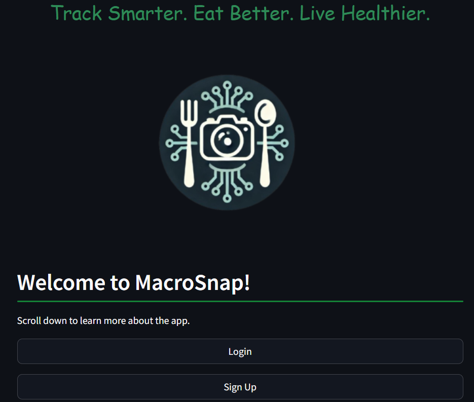
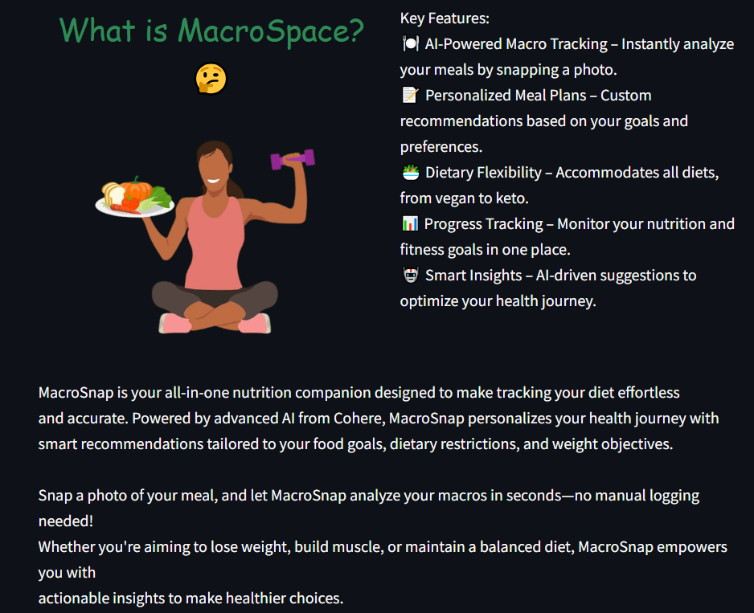
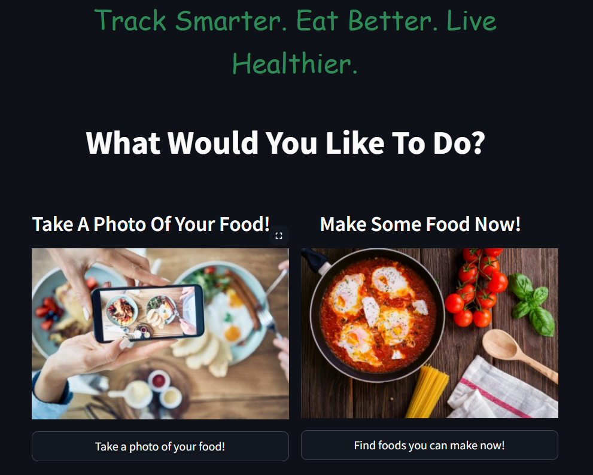

  

  <h1>MacroSnap</h1>
  
 One major problem with healthy eating is that people often struggle to plan meals that align with their goals and available ingredients. MacroSnap is a food recommendation app, personalized to suggest healthy recipes and provide macronutrient insights using food photos. 

  
  
  

[Website Link]()

## What Is MacroSnap?
MacroSnap is an innovative food recommendation and macro-tracking app that uses Python, CSS and Streamlit to provide an intuitive interface for users to discover healthy meal options. With the help of a quick questionnaire, users input their dietary preferences, food goals, and available ingredients. Using generative AI, MacroSnap generates personalized meal suggestions, including macro breakdowns, to guide users toward healthier eating habits. Whether you're trying to lose weight, build muscle, or improve overall health, MacroSnap offers tailored solutions to help you reach your food and fitness goals efficiently.

## Features
* **Questionnaire:** We make use of an interactive questionnaire to gauge users eating habits and give them the best suggestions for them.
* **Generative AI:** Using the information gained from the questionnaire, we provide food suggestions for the user to make benefiting their goals.
* **Image Recognition:** Using image recognition, we provide accurate information about the food the user is eating, stating the macronutrients of each dish.
* **Login Database:** We make use of a database to store each users log in information securely.

## Contributors
* [Krish (@KR1-SH)](https://github.com/KR1-SH)
* [Zain (@Zain-Naqvi-tech)](https://github.com/Zain-Naqvi-tech)
* [Akshayan (@Akkipr)](https://github.com/Akkipr)
* [CJ (@CJButlers)](https://github.com/CJButlers)

## Technologies Used
### Frontend
* **Python**
* **CSS**
* **Streamlit**

### Backend
* **Python**
* **Cohere API**
* **Firebase**
* **Ollama**
